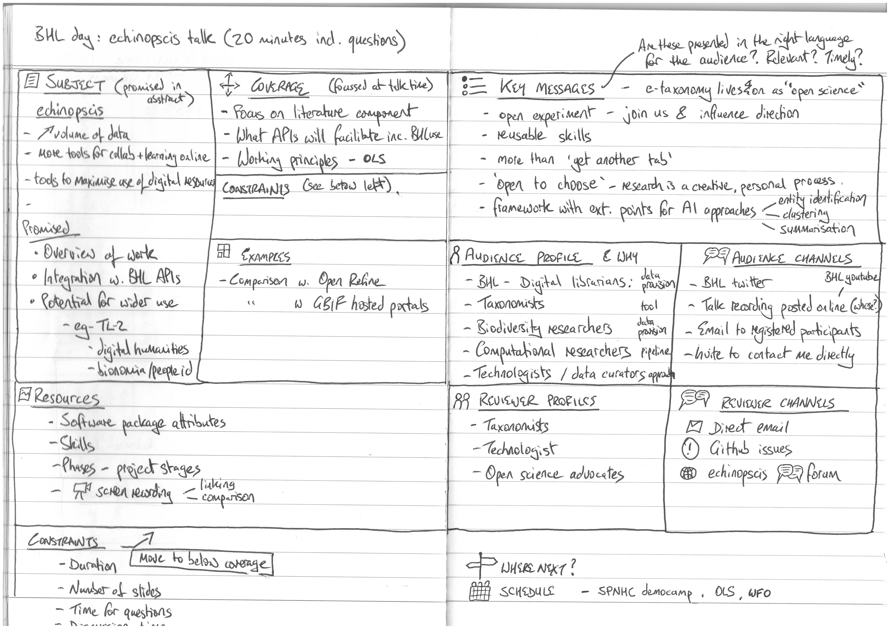

# bhl-2023-abstract

## About this repository

This repository holds talk materials submitted to the BHL public symposium arranged as part of the BHL 2023 meeting.

## Symposium: "Fostering Data Driven Natural Science through Open Digital Libraries"

> Recent years have witnessed a spectacular increase of data available for research, through either digital conversion or in born digital form vastly increasing outcomes based on data driven science. In natural sciences, especially in taxonomy and systematics, this new data forward context has allowed for the emergence of the concept of “digital specimen”, where a digital representation of a physical specimen is linked to additional information stored in external databases.
> 
> Documents from digital libraries, particularly the Biodiversity Heritage Library, rank among the most relevant data for taxonomy and systematics. This literature includes key data points such as first descriptions, occurrences, specimen information, morphology, illustrations, and other key information.
>
> However, digital libraries with these data are often silos or are unable to provide data under FAIR (Findable, Accessible, Interoperable, and Reusable) principles. Opening up these silos and building bridges between platforms necessitates various efforts, including the provision of persistent identifiers, structured metadata, and access via automated protocols and APIs.
> 
> These efforts towards interoperability foster the creation of important biodiversity networks, from the local (individual institutions) through national and international networks, bringing together librarians, researchers, and computer scientists to increase access to data that supports a thriving and sustainable planet.
>
> This symposium, organized as part of the 2023 BHL Annual Meeting, will be held in the auditorium of the Grande Galerie de l’Evolution of the Muséum national d’Histoire naturelle (Paris, 75005). Open to all members of the digital library or biodiversity community, it intends to promote the sharing of knowledge between experts from different countries, different contexts and different professional backgrounds.

## Submitted version of abstract

**echinopscis - an extensible notebook for open science on specimens**

Through BHL's lifetime, we've seen a vast increase in the volume of digital data available for research, along with improved tooling (for data access, analysis, visualisation and publishing), and more accessible resources for online participation and learning. We may be finally able to realise the promise of "e-taxonomy" - tooling and working practices to enable to online, collaborative taxonomic research - originally proposed alongside BHL. At Kew, we are developing "echinopscis" (https://echinopscis.github.io) - writing / linking / reference management tools for researchers to maximise use of digital resources. (By "references" we mean all the elements used by taxonomists when drafting monographic or floristic research, ie specimens, names, taxonomies, published descriptions, people and institutions - as well as literature references.) Research is often a personal and creative process - we want to enable maximum flexibility, for researchers to be "open to choose" how they organise their work. We are using open science principles and managing this effort as a community project, trying to deliver useful outputs (software, documentation, collaboration networks) as we go. We will discuss the work and future directions - integration with BHL APIs and the potential for interlinking BHL content using metadata resources like Taxonomic Literature 2. 

## Constraints

- Date and time: 19 April 2023, 1330-1800 CEST
- Venue:  Auditorium de la Grande Galerie de l’Evolution, Muséum national d’Histoire naturelle (MNHN), Paris, France
- Duration: 20 minutes
- Questions at end of session, not end of talk
- Recorded for posting on line

## Planning talk

This talk was also an experiment in using an ["Open Canvas"](https://mozilla.github.io/open-leadership-training-series/articles/opening-your-project/develop-an-open-project-strategy-with-open-canvas/) style planning document for a talk - see:

## Talk slides:
- [Nicolson_BHLDay2023.pptx](Nicolson_BHLDay2023.pptx)
- [Nicolson_BHLDay2023.pdf](Nicolson_BHLDay2023.pdf)

## Links
- [BHL 2023 meeting](https://confluence.si.edu/display/BHLopen/2023+BHL+Annual+Meeting+Logistics)
- [BHL 2023 public symposium](https://about.biodiversitylibrary.org/get-involved/events/bhl-day-2023/)
